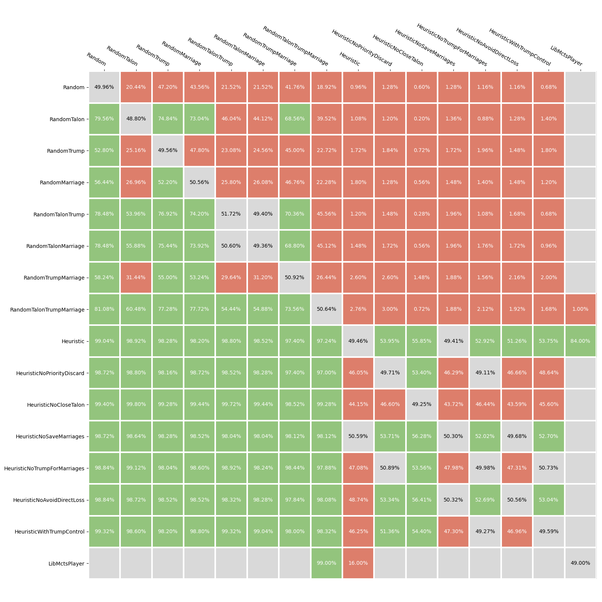
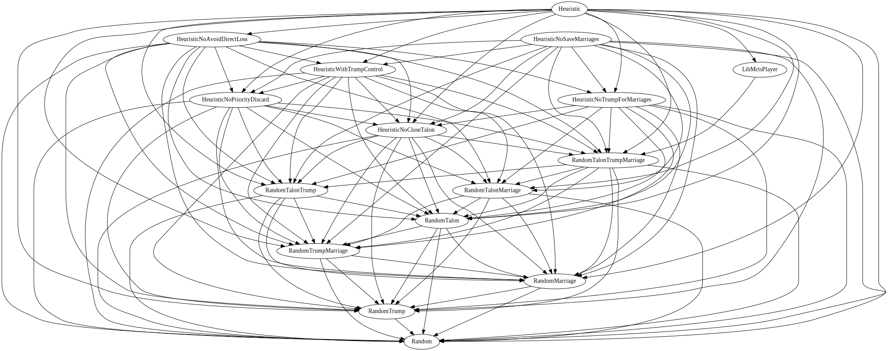

# Eval Results

### Results table

### Stack Ranking

# References

* *Magic Math: How Many Games Do You Need for Statistical Significance in
  Playtesting?*, Frank Karsten
  [[link]](https://strategy.channelfireball.com/all-strategy/mtg/channelmagic-articles/magic-math-how-many-games-do-you-need-for-statistical-significance-in-playtesting/)